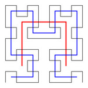

<!-- ### Overview

This repository contains recursion-based implementation of Hilbert Curve Sorting algorithms for 2-tuples and 3-tuples.

### Motive

Sorting, by intuition, gives an ordering of a set where the distance between neighboring elements is minimized.
It is heavily used for DB indexing, visualization and a myriad of other purposes.

> The distance may be measured in Hamming Distance for bits, or Euclidean 2-norm for vectors.

Sometimes our data is multi-dimensional,
like sRGB colors { $(r, g, b)|r, g, b \in [0, 255]$ },
or vectors in $\mathbb{R}^n, n \gt 1$ in general.
Unlike the real numbers $\mathbb{R}$,
we encounter challenges when trying to sort data in higher dimensional spaces.

The simplest sort one might use is the Lex Order, which compares the first non-identical component of tuples, but this approach has many flaws.

> Just take $[00, 01, 10, 11]$ as an example, Lex Order will return the original sequence, which fails to minimize element-wise Hamming Distance.  
> A better ordering is $[00, 01, 11, 10]$, which is the Gray Code sequence $G_2$.

### Solution
Mapping from $\mathbb{R}^n$ to $\mathbb{R}$
could be achieved through the inverse map of Hilbert Curves,
which are space-filling curves whose limit is a n-hypercube.

> Technically the Hilbert Curves maps the unit interval $[0, 1]$ to the unit n-hypercube $U_n$, but the hypercube could be offsetted and scaled to fit our data.
> The inverse map, as a result, might not return the unit interval, but ordering is preserved.

Neighboring tuples in the input space will also end up close to each other on the Hilbert Curve,
preserving the spatial relationship between the input points.
$\mathbb{R}^n$ with the ordering will possess a total order.

> The Hilbet Curve $\mathbb{H}: \mathbb{R} \rightarrow \mathbb{R}^n$ is surjective, so its inverse mapping is multivalued.
> The algorithms will only return one of the possible values, consistently.

### Implementation

Some key properties of the Hilbert Curves that allows us to implement a recursive algorithm is, 
that they are locality-preserving space-filling curves,
and that they are fractals. Details below.

- Locality-preserving - Points on the Hilbert Curve converges to a definite point as iteration count increases.
> This is in general not true for other curves, where the resulting points might shift vastly over iterations.

- Fractalness - Every iteration $\mathbb{H}\_n$ implicitly traces (scaled) $\mathbb{H}\_{n-k}, k \le n$ curves.

>
> 
>   
> _2d Hilbert Curves Overlay 1st-3rd Iterations ~ Fractalness_  
> _Images by Geoff Richards (Qef) - Own work, Public Domain_

___

Now, take the $U\_2$ case as an example for simplicity of illustration.

Divide $U\_2$ into 4 quadrants, denoted by $'00, 01, 11, 10'$ respectively (the 1st bit represents if $x \gt 0.5$ and the 2nd, $y \gt 0.5$).
Notice, by fractalness of the curve, no matter how high the iteration count (even at $\infty$, where its limit _is_ $U\_2$),
points in $01$ always come after the ones in $00$, the ones in $11$ always come after the ones in $01$, and so on.

> The orientation of $n$-d Hilbert Curve is based off the Gray Code sequence $G\_n$, interpreting the bits as mentioned above, generalized.  
> This is intuitive as the Gray Code is a permutation of the Bit Code, which contains every vertex of $U\_n$, and only one bit (axis) is flipped (shifted) between successive Gray Code bits.

This allows us to divide an arbitrary number of points into quadrants and sort the quadrants instead, after which we concatenate the results in $\mathbb{H}_1$ order, recursively.

Before sorting the quadrants, they must be rotated or flipped to scaled & offsetted $\mathbb{H}_1$, as the recursive algorithm devides the square according to it.

The recursion base will be when there are only 1 vector or none left, or if all vectors are identical. The input vectors will be returned.

The recursion step will fit the vectors to a hypercube with scale $2^k$, run recursion, and return de-fitted result vectors.

### Demo
I included an interactive [Demo Page](assets/demo.html) which could be downloaded directly and opened in a browser (no additional assets have to be downloaded). It contains demos of:

- 2-D points sorting - connects set / random 2d points according to the sorted sequence.
> The result from sorting random points will roughly estimate a hilbert curve.

- Colors (sRGB) sorting - sorting sRGB colors, using $(R, G, B)$ as the color vector, with a pre/post-sort comparison.
> The result would be more gradient-like (overall) than the raw version.  
> HSL might give better results (?), you could experiment with it freely, through minor changes to the demo.html script source code.

### Notes

The time complexity of the algorithms is estimated to be $O(n)$ where n is the number of vectors in the hypercube
(complexity analysed w.r.t. number of function calls). This, however, ignores constant factors and overhead of recursion function calls.

Space complexity of the algorithms is expected to be high, as recursion is heavily used.

Overall performance should be pretty good as a toy, but since $n$ scales with $(s + 1)^n$, where $s$ is side length of hypercube and $n$ is hypercube's dimension, this might get extremely computational and memory demanding as $s$ scales.

Due to the heavy use of recursion, asynchronous operations are used to spread computational load.

### Misc

Generalization to even higher dimensions is possible, but I only implemented $\mathbb{R}^2$ and $\mathbb{R}^3$ algorithms here, in JS (I know, I know, it's slow, but whatever).

Non-recursive implementation in C and generalization to all dimensions could be found at [Non-recursive Hilbert Curve on GitHub](https://github.com/adishavit/hilbert/tree/master). -->
